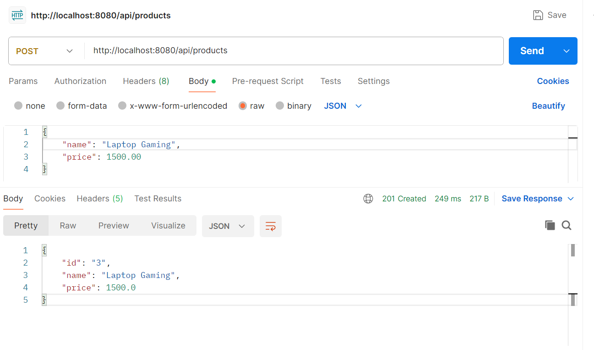
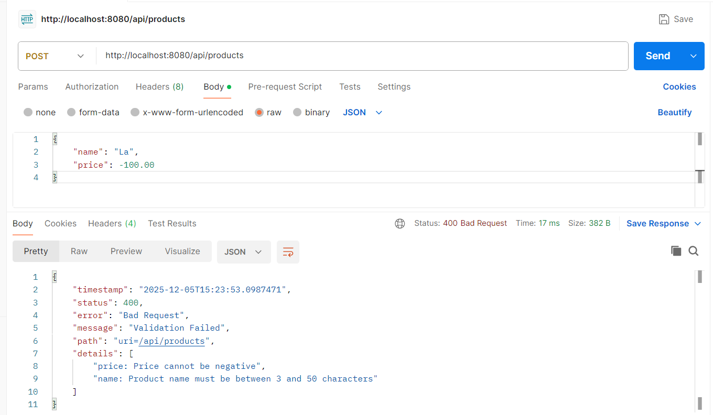
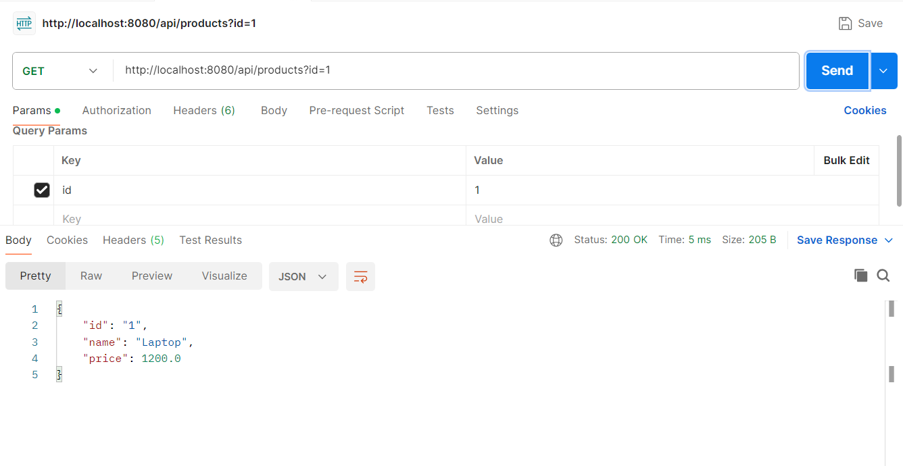
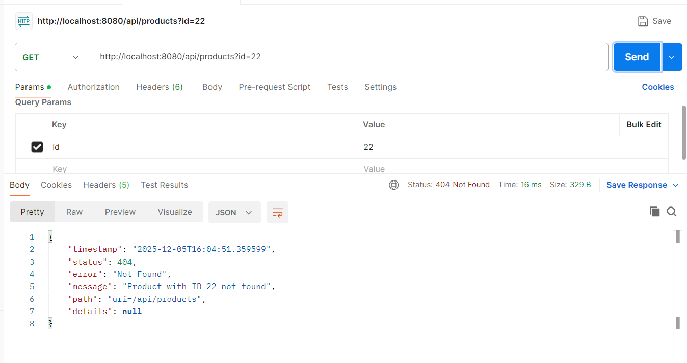

# Error Handling Spring Boot

A comprehensive Spring Boot REST API project demonstrating best practices for error handling and validation in modern Java applications.

## 📋 Table of Contents

- [Overview](#overview)
- [Features](#features)
- [Technologies](#technologies)
- [Project Structure](#project-structure)
- [Getting Started](#getting-started)
- [API Endpoints](#api-endpoints)
- [Error Handling](#error-handling)
- [API Examples](#api-examples)
- [License](#license)

## 🎯 Overview

This project demonstrates a robust error handling mechanism in Spring Boot applications using `@RestControllerAdvice` and custom exception handlers. It includes validation, custom exceptions, and standardized error responses for a Product management API.

## ✨ Features

- **Global Exception Handling** - Centralized error handling using `@RestControllerAdvice`
- **Custom Exceptions** - Custom `ResourceNotFoundException` for resource-specific errors
- **Request Validation** - Bean validation using Jakarta Validation annotations
- **Standardized Error Responses** - Consistent error response structure across all endpoints
- **RESTful API Design** - Clean and intuitive API endpoints
- **Lombok Integration** - Reduced boilerplate code with Lombok annotations

## 🛠 Technologies

- **Java 21**
- **Spring Boot 4.0.0**
- **Spring Web MVC**
- **Spring Validation**
- **Lombok**
- **Maven**

## 📁 Project Structure

```
error-handling-springboot/
├── src/main/java/com/onedev/
│   ├── controller/
│   │   └── ProductController.java          # REST API endpoints
│   ├── exception/
│   │   ├── GlobalExceptionHandler.java     # Global exception handler
│   │   └── ResourceNotFoundException.java  # Custom exception
│   ├── model/
│   │   └── Product.java                    # Product entity
│   ├── payload/
│   │   ├── ErrorResponse.java              # Error response DTO
│   │   ├── ProductRequest.java             # Product request DTO
│   │   └── ProductResponse.java            # Product response DTO
│   ├── service/
│   │   ├── ProductService.java             # Service interface
│   │   └── ProductServiceImpl.java         # Service implementation
│   └── ErrorHandlingSpringbootApplication.java
└── pom.xml
```

## 🚀 Getting Started

### Prerequisites

- Java 21 or higher
- Maven 3.6+

### Installation

1. Clone the repository:
```bash
git clone https://github.com/Ruswanda2020/error-handling-springboot.git
cd error-handling-springboot
```

2. Build the project:
```bash
mvn clean install
```

3. Run the application:
```bash
mvn spring-boot:run
```

The application will start on `http://localhost:8080`

## 🔌 API Endpoints

### Product Management

| Method | Endpoint | Description |
|--------|----------|-------------|
| POST | `/api/products` | Create a new product |
| GET | `/api/products?id={id}` | Get product by ID |
| GET | `/api/products/error` | Trigger a generic error (for testing) |

## 🛡 Error Handling

The application implements three types of exception handlers:

### 1. ResourceNotFoundException Handler
Handles cases when a requested resource is not found.
- **HTTP Status**: 404 NOT FOUND
- **Response**: Standardized error response with details

### 2. MethodArgumentNotValidException Handler
Handles validation errors for request body.
- **HTTP Status**: 400 BAD REQUEST
- **Response**: Error response with validation details

### 3. Generic Exception Handler
Catches all unhandled exceptions.
- **HTTP Status**: 500 INTERNAL SERVER ERROR
- **Response**: Generic error response

### Error Response Structure

```json
{
  "timestamp": "2025-12-05T16:11:25",
  "status": 404,
  "error": "Not Found",
  "message": "Product not found with id: 123",
  "path": "uri=/api/products",
  "details": null
}
```

## 📸 API Examples

### POST - Create Product (Success)

**Request:**
```json
{
  "name": "Laptop",
  "price": 1500.00
}
```

**Response:**



### POST - Create Product (Validation Failed)

**Request:**
```json
{
  "name": "AB",
  "price": -100
}
```

**Response:**



### GET - Retrieve Product (Success)

**Request:**
```
GET /api/products?id=550e8400-e29b-41d4-a716-446655440000
```

**Response:**



### GET - Retrieve Product (Not Found)

**Request:**
```
GET /api/products?id=invalid-id
```

**Response:**



## 📝 Validation Rules

### ProductRequest

- **name**: 
  - Required (not blank)
  - Length: 3-50 characters
- **price**: 
  - Minimum value: 0 (cannot be negative)

## 🤝 Contributing

Contributions are welcome! Please feel free to submit a Pull Request.

## 📄 License

This project is open source and available under the [MIT License](LICENSE).

---

**Author**: OneDev  
**Version**: 0.0.1-SNAPSHOT
